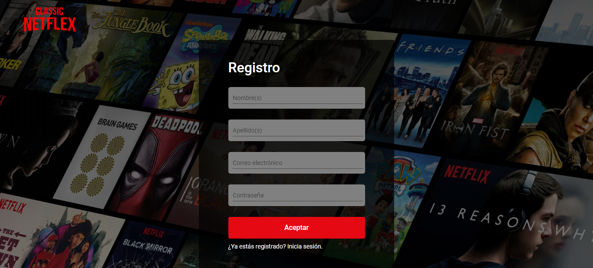
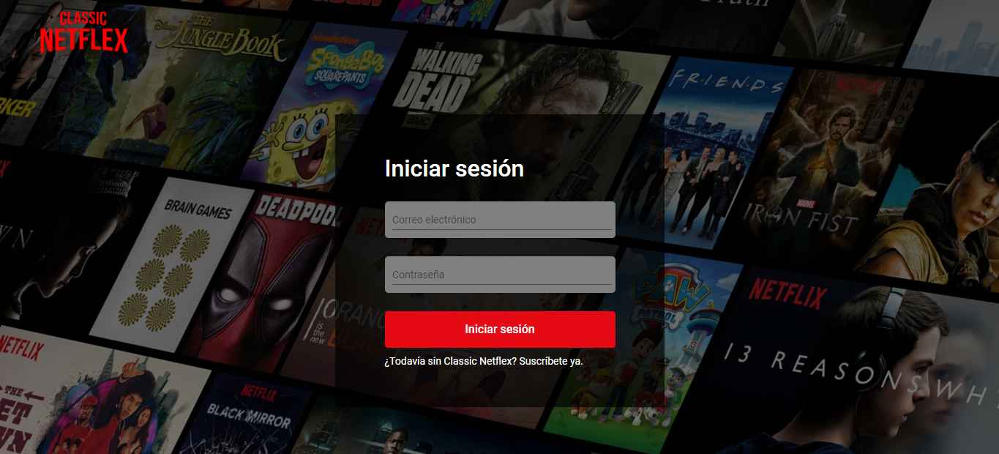
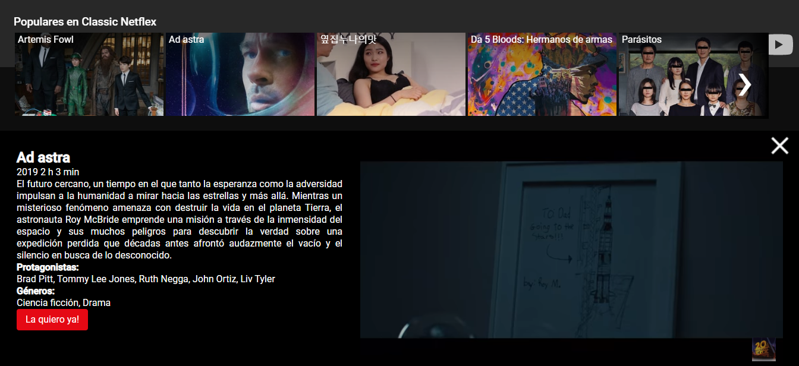
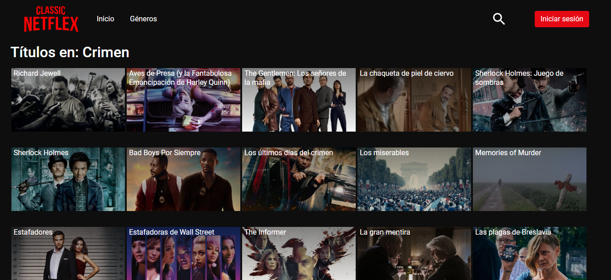
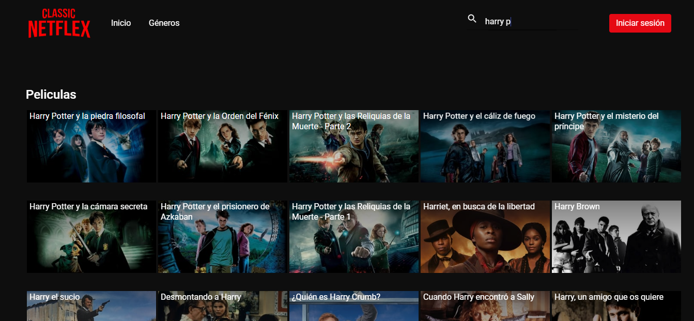

# Classic-Netflex

This was my fifth coding Bootcamp project: a videoclub.

It was made with Angular, TypeScript, Bootstrap, NodeJS, ExpressJS & MySQL.

## Views

### Home

### Registration

frontend/src/assets/img/

### Login

### Movie details

### Search by genre

### Search by title

 

You can see the demo here: https://classic-netflex.herokuapp.com/

Made by [Jennifer Goijman](https://github.com/JenniferGoijman)
